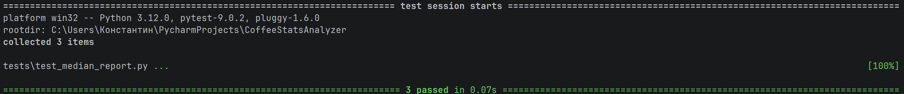

# CoffeeStatsAnalyzer

Скрипт читает CSV-файлы с данными о подготовке студентов к экзаменам и формирует
консольный отчет. Сейчас реализован отчет `median-coffee`: медианная сумма трат
на кофе по каждому студенту за весь период, отсортированная по убыванию трат.

## Требования

- Python 3.10+
- Зависимость для вывода таблиц: `tabulate`
- Для тестов: `pytest`

## Установка зависимостей

```bash
pip install tabulate pytest
```

## Запуск

Пример запуска с файлами из папки `Example`:

```bash
python main.py --files Example\math.csv Example\physics.csv Example\programming.csv --report median-coffee
```

Можно передавать несколько файлов, отчет строится по всем данным сразу.


## Формат CSV

Ожидаемые поля (минимум):

- `student`
- `coffee_spent`

Остальные поля могут присутствовать, но на отчет не влияют.

## Тесты

```bash
pytest
```



## Добавление новых отчетов

Пример можно посмотреть в ветке `new-report` — там в README есть описание.

1. Напишите функцию-строитель, которая принимает список записей и возвращает
   строки отчета (список списков).
2. Добавьте новую запись в `REPORTS` в `main.py`, указав имя, заголовки и
   функцию-строитель.
3. Передавайте имя отчета через `--report`.
